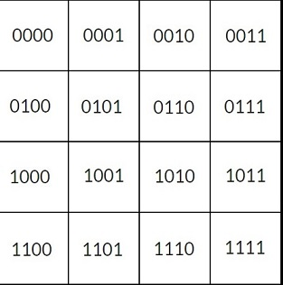

# QGames

## Quantum Board Run

Game consists of 2 player trying to eliminate each other.  
In each term, first the defending player is allowed to move on the board and after that the attacking player is allowed to place a bomb on the defender's board.  
After this the board updates with the new position of defending player and if the bomb damages the player, health is reduced by one heart. Once the defender is out of all three hearts, the attacking player wins.
After each turn, the attacking and defending players switch.  
#### To play one can just run the .py file. (it also works with .pynb)
### Rules:
+ Defending Player is allowed to move in 2 different ways:
  - Classical : Here the  player can move to any of the 8 positions surrounding the current position (like a king in chess), and the position of the coin will show the predicted position of the player.  
        
      All the tick blocks are permited to move.
  - Quantum : Here the player is allowed to make a superposition of the position (denoted by the coin) keeping in mind that the current position should be in the superposition. And the player's position will be updated according to the collapse of the superposition state.  
      
+ Attacking Player can place the bomb only at one of the blocks on opponent's board and as there is no superposition only "X" gate is permitted to used.
+ The Bomb explodes in a way that it damages the board with a "+" sign and if the player is in that position, player will receive the damage. 
+ After the selection of the state in any of the defending and attacking cases, one should press enter to fix the state and then after that press enter to strt the count down for the second player's turn.
+ While making the state remember that controlled gates cost much more than the single qubit gates so to compensate for that if you choose to apply controlled gates the whole column will be unusable for any other gates.
+ Permitted Gates are :
  - H
  - X
  - CH
  - CX
  - CCX
  - MCX (multiple controle x gate)
+ Circuit Arrangement:   
    
+ Board Arrangement:  
   
### Its my first try. Feedback and Modifications are welcomed. Thanks for visiting.
## Authors

* **Rohit Prasad** - [CodieKev](https://github.com/CodieKev) - [Rohit Prasad](https://www.linkedin.com/in/rohit-prasad-codie-5845b11a9/)

## License

This project is licensed under the Apache-2.0 License - see the [LICENSE](LICENSE) file for details
